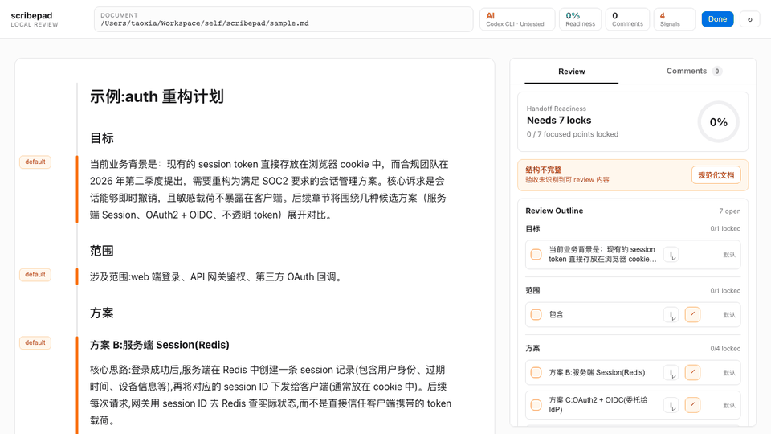

# scribepad

[English](./README.md) | **中文**

在 AI coding agent 真正开始改代码前，先把它写的 plan 看清楚、批注好、拍板确认。

scribepad 是一个 local-first 的 Markdown Review 工作台，面向使用 Codex、Claude Code、Cursor、Aider 等 AI coding agent 的开发者。它把 `plan.md`、设计文档、调研记录、实现方案这类长文档变成浏览器里的 Review 页面：你可以阅读结构、锁定关键决定、选段批注、查看 AI 改写 diff，然后把确认后的文档交回给 agent 继续执行。



## 解决什么问题

AI coding agent 很会写 plan，但从“生成 plan”到“放心执行”之间经常断档：

- 200 行 Markdown plan 在 terminal / editor 里很难快速扫清楚；
- 改写几轮之后，不知道哪些内容已经定了、哪些还在讨论；
- agent 下一轮可能悄悄改掉你已经确认过的决定；
- 下一个 agent run 需要的是干净的执行文档，不是一堆聊天历史。

scribepad 的定位就是：放在“AI 写完 plan”和“AI 开始实现”之间，作为人的确认闸口。

## 你可以做什么

- 打开本地 Markdown plan，在浏览器里集中阅读。
- 从文档中提取 Review outline，并锁定关键检查点。
- 选中文本创建批注，让 AI CLI 改写某一段。
- 在 diff modal 里确认改动，再写回源 Markdown。
- 使用 `--wait` 让 shell 驱动的 agent 暂停，直到你点击 `Done`。
- 导出一份 agent 可读取的、已经确认过的 Markdown 文档。

## 适合谁

如果你的工作流是这样，scribepad 会更有用：

- 让 Claude Code、Codex、Cursor 或 Aider 先写 plan，再开始编码；
- 把 spec、plan、design doc、research note 放在仓库里的 Markdown 文件中；
- 希望 agent 实现前有一个明确的人类确认步骤；
- 不想让关键决定散落在 chat history 里，过几天再也找不到。

## Keywords

AI coding plan review、Claude Code plan review、Codex workflow、vibe coding plan、Markdown review tool、local-first AI development workflow。

## 使用流程

```bash
scribepad sample.md --wait
```

命令会打开浏览器 Review 页面，并一直等待你点击 `Done`。

点击 `Done` 后，stdout 只输出一行：确认后的导出 Markdown 路径。

```bash
APPROVED_PLAN=$(scribepad sample.md --wait)
cat "$APPROVED_PLAN"
```

这样 Codex、Claude Code 或任何 shell 驱动的 agent 都可以在这里停住，等用户确认，再读取确认后的文档继续执行。

## 安装

直接从 GitHub 运行：

```bash
npx --yes github:xiatiandeairen/scribepad sample.md
```

作为 agent handoff 闸口：

```bash
APPROVED_PLAN=$(npx --yes github:xiatiandeairen/scribepad sample.md --wait)
cat "$APPROVED_PLAN"
```

如果要本地开发，从仓库根目录执行：

```bash
npm install
npm run build
npm link
```

再运行本地链接的 CLI：

```bash
scribepad sample.md
```

## 开发

```bash
npm run dev
npm run typecheck
npm test
npm run lint
npm run test:e2e:session
```

## 数据存放

scribepad 使用 XDG 目录，避免把运行态文件散落到项目里：

- 配置：`$XDG_CONFIG_HOME/scribepad/...`
- 运行时 registry：`$XDG_RUNTIME_DIR/scribepad/...`
- Review 状态和导出文档：`$XDG_STATE_HOME/scribepad/...`

源 Markdown 仍留在项目仓库中。Review 状态和 agent handoff 文档存放在仓库外。

## 项目文档

- Architecture: [docs/architecture.md](./docs/architecture.md)
